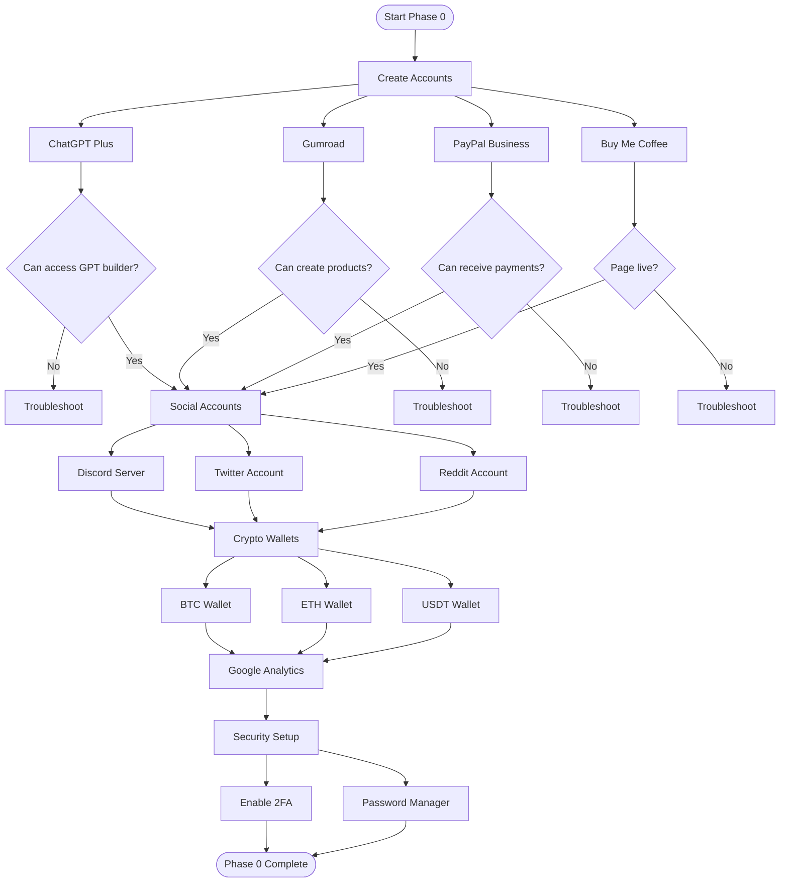
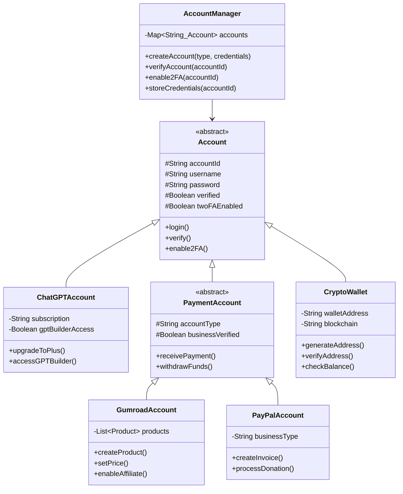
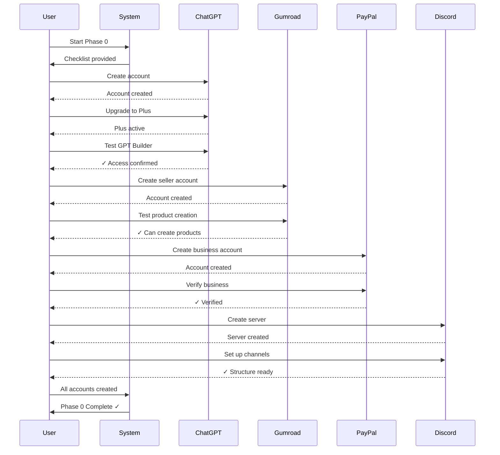
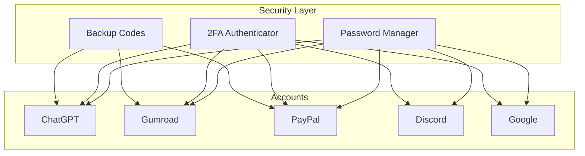

# 📊 PHASE 0: PRE-LAUNCH SETUP - UML DIAGRAMS

## Account Setup Flow

```mermaid
flowchart TD
    Start([Start Phase 0]) --> Accounts[Create Accounts]

    Accounts --> GPT[ChatGPT Plus]
    Accounts --> GUM[Gumroad]
    Accounts --> PAY[PayPal Business]
    Accounts --> BMC[Buy Me Coffee]

    GPT --> VerifyGPT{Can access GPT builder?}
    GUM --> VerifyGUM{Can create products?}
    PAY --> VerifyPAY{Can receive payments?}
    BMC --> VerifyBMC{Page live?}

    VerifyGPT -->|No| FixGPT[Troubleshoot]
    VerifyGPT -->|Yes| Social[Social Accounts]

    VerifyGUM -->|No| FixGUM[Troubleshoot]
    VerifyGUM -->|Yes| Social

    VerifyPAY -->|No| FixPAY[Troubleshoot]
    VerifyPAY -->|Yes| Social

    VerifyBMC -->|No| FixBMC[Troubleshoot]
    VerifyBMC -->|Yes| Social

    Social --> Discord[Discord Server]
    Social --> Twitter[Twitter Account]
    Social --> Reddit[Reddit Account]

    Discord --> Crypto[Crypto Wallets]
    Twitter --> Crypto
    Reddit --> Crypto

    Crypto --> BTC[BTC Wallet]
    Crypto --> ETH[ETH Wallet]
    Crypto --> USDT[USDT Wallet]

    BTC --> Analytics[Google Analytics]
    ETH --> Analytics
    USDT --> Analytics

    Analytics --> Security[Security Setup]
    Security --> TwoFA[Enable 2FA]
    Security --> PassMgr[Password Manager]

    TwoFA --> Complete([Phase 0 Complete])
    PassMgr --> Complete
```

## Infrastructure Components

```mermaid
classDiagram
    class AccountManager {
        -Map~String_Account~ accounts
        +createAccount(type, credentials)
        +verifyAccount(accountId)
        +enable2FA(accountId)
        +storeCredentials(accountId)
    }

    class Account {
        <<abstract>>
        #String accountId
        #String username
        #String password
        #Boolean verified
        #Boolean twoFAEnabled
        +login()
        +verify()
        +enable2FA()
    }

    class ChatGPTAccount {
        -String subscription
        -Boolean gptBuilderAccess
        +upgradeToPlus()
        +accessGPTBuilder()
    }

    class PaymentAccount {
        <<abstract>>
        #String accountType
        #Boolean businessVerified
        +receivePayment()
        +withdrawFunds()
    }

    class GumroadAccount {
        -List~Product~ products
        +createProduct()
        +setPrice()
        +enableAffiliate()
    }

    class PayPalAccount {
        -String businessType
        +createInvoice()
        +processDonation()
    }

    class CryptoWallet {
        -String walletAddress
        -String blockchain
        +generateAddress()
        +verifyAddress()
        +checkBalance()
    }

    AccountManager --> Account
    Account <|-- ChatGPTAccount
    Account <|-- PaymentAccount
    PaymentAccount <|-- GumroadAccount
    PaymentAccount <|-- PayPalAccount
    Account <|-- CryptoWallet
```

## Verification Sequence

```mermaid
sequenceDiagram
    participant User
    participant System
    participant ChatGPT
    participant Gumroad
    participant PayPal
    participant Discord

    User->>System: Start Phase 0
    System->>User: Checklist provided

    User->>ChatGPT: Create account
    ChatGPT-->>User: Account created
    User->>ChatGPT: Upgrade to Plus
    ChatGPT-->>User: Plus active
    User->>ChatGPT: Test GPT Builder
    ChatGPT-->>User: ✓ Access confirmed

    User->>Gumroad: Create seller account
    Gumroad-->>User: Account created
    User->>Gumroad: Test product creation
    Gumroad-->>User: ✓ Can create products

    User->>PayPal: Create business account
    PayPal-->>User: Account created
    User->>PayPal: Verify business
    PayPal-->>User: ✓ Verified

    User->>Discord: Create server
    Discord-->>User: Server created
    User->>Discord: Set up channels
    Discord-->>User: ✓ Structure ready

    User->>System: All accounts created
    System->>User: Phase 0 Complete ✓
```

## Security Setup

```mermaid
graph TB
    subgraph "Security Layer"
        PM[Password Manager]
        TFA[2FA Authenticator]
        BACKUP[Backup Codes]
    end

    subgraph "Accounts"
        ACC1[ChatGPT]
        ACC2[Gumroad]
        ACC3[PayPal]
        ACC4[Discord]
        ACC5[Google]
    end

    PM --> ACC1
    PM --> ACC2
    PM --> ACC3
    PM --> ACC4
    PM --> ACC5

    TFA --> ACC1
    TFA --> ACC2
    TFA --> ACC3
    TFA --> ACC4
    TFA --> ACC5

    BACKUP --> ACC1
    BACKUP --> ACC2
    BACKUP --> ACC3
```