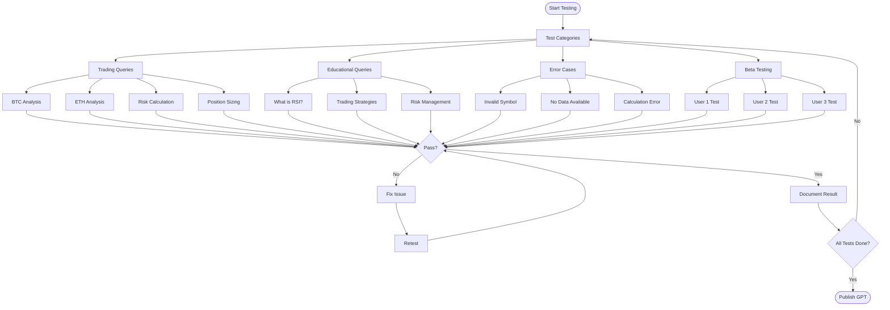

# 📊 PHASE 1: MVP GPT CREATION - UML DIAGRAMS

## GPT Configuration Architecture

## MVP Response Flow

## Testing Framework

## Core Components Interaction

## State Diagram - GPT Response Generation

## Knowledge Base Structure

