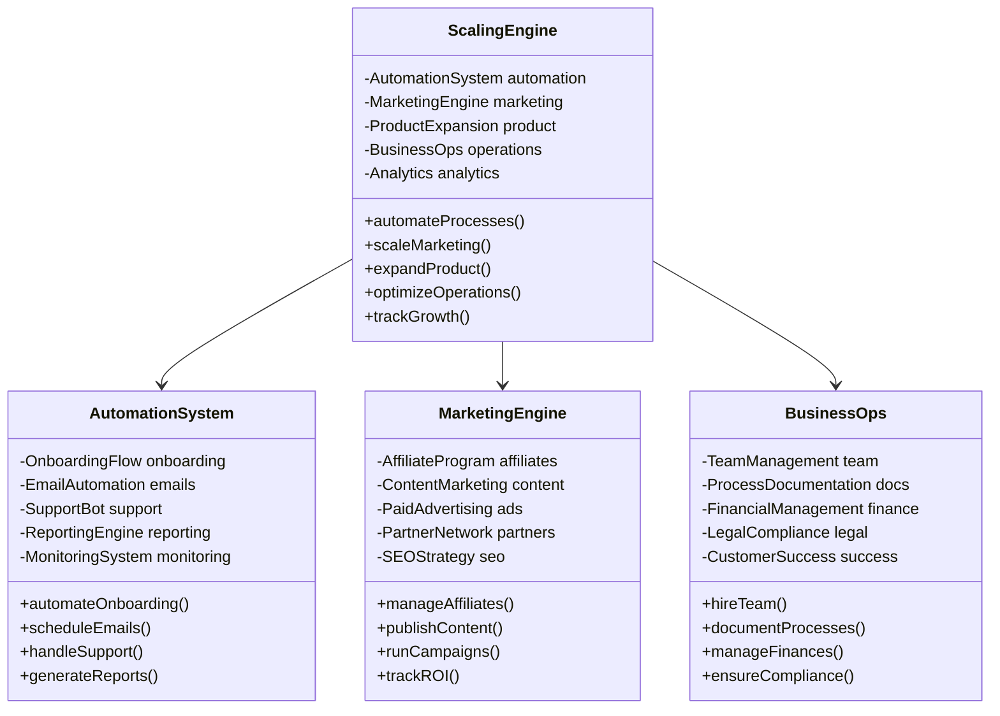
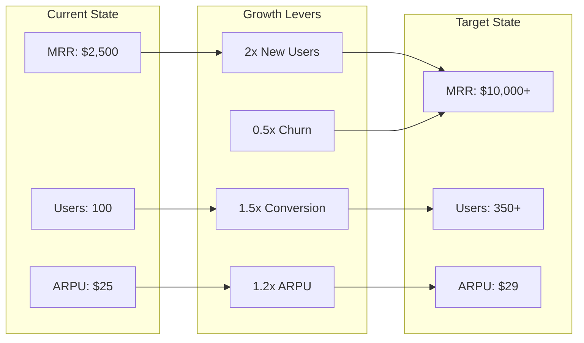
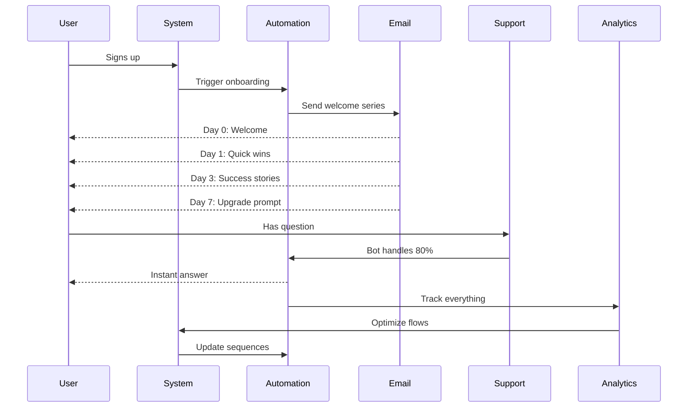
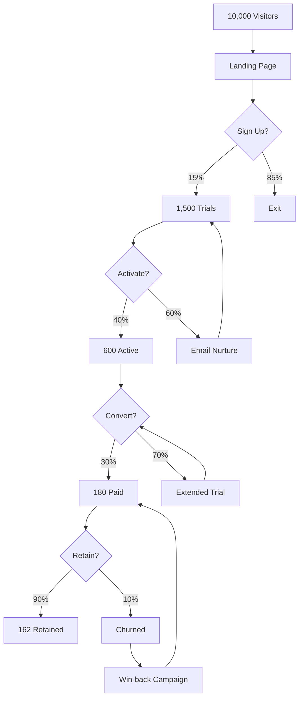
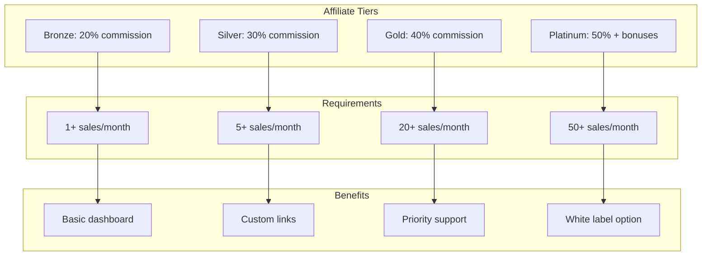
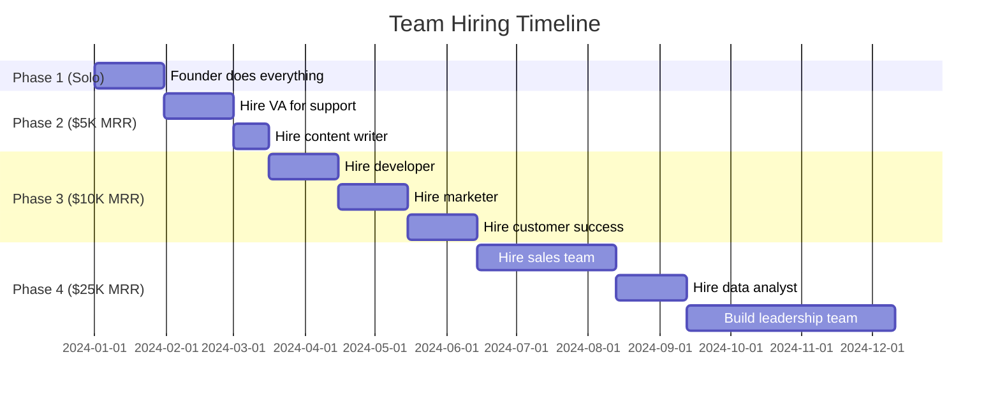
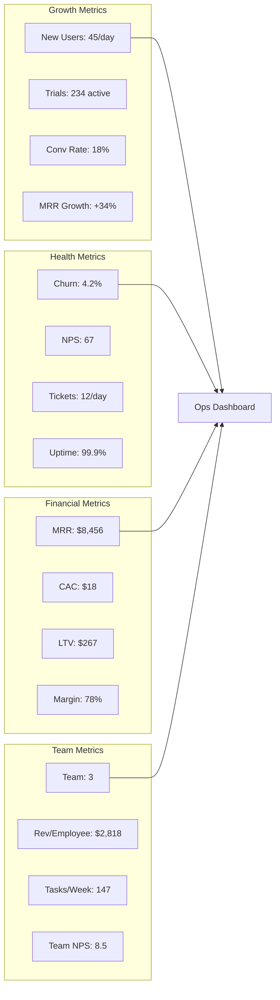
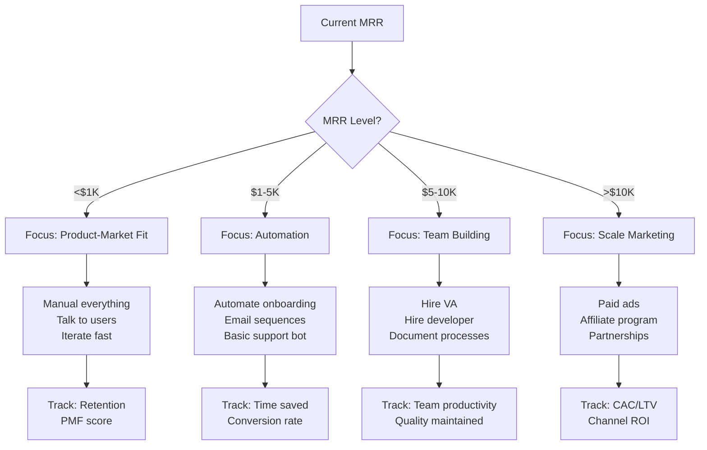
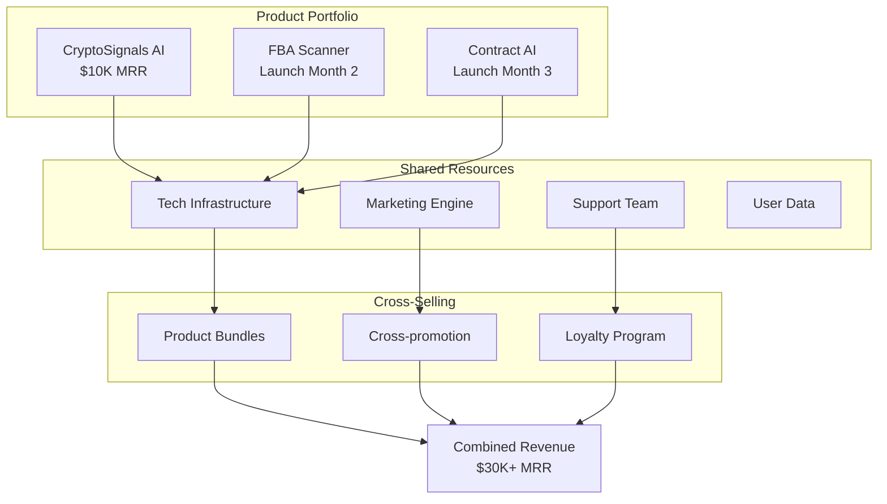

# 📊 PHASE 10: SCALE TO $10K MRR - UML DIAGRAMS

## Scaling Architecture



## Revenue Scaling Path



## Automation Pipeline



## Marketing Funnel Optimization



## Affiliate Program Structure



## Team Scaling Plan



## Product Expansion Roadmap

```mermaid
stateDiagram-v2
    [*] --> CoreGPT: Launch Core GPT

    CoreGPT --> MobileApp: Build Mobile App
    CoreGPT --> BrowserExt: Chrome Extension
    CoreGPT --> DiscordBot: Discord Integration

    MobileApp --> Ecosystem: Connected Ecosystem
    BrowserExt --> Ecosystem
    DiscordBot --> Ecosystem

    Ecosystem --> WhiteLabel: Enterprise Solution
    Ecosystem --> API_Platform: Developer Platform

    WhiteLabel --> Scale: Scale to $100K MRR
    API_Platform --> Scale

    Scale --> NextGPT: Launch GPT #2
    NextGPT --> [*]: Repeat Process
```

## Operations Dashboard



## Scaling Decision Tree



## Multi-Product Strategy

