# 📊 PHASE 2: ENGAGEMENT MAXIMIZATION - UML DIAGRAMS

## Engagement System Architecture


## Conversation Flow Optimization

```mermaid
flowchart TD
    Start([User Query]) --> Response[Generate Response]

    Response --> AddHook[Add Engagement Hook]

    AddHook --> Types{Hook Type}
    Types --> Cliff[Cliffhanger: "But there's more..."]
    Types --> Question[Question: "Want to see how deep this goes?"]
    Types --> Tease[Teaser: "I found something interesting..."]
    Types --> Challenge[Challenge: "Can you beat the market?"]

    Cliff --> PromptNext[Prompt Next Query]
    Question --> PromptNext
    Tease --> PromptNext
    Challenge --> PromptNext

    PromptNext --> UserEngaged{User Continues?}

    UserEngaged -->|Yes| Points[Award Points +10]
    UserEngaged -->|No| Remind[Schedule Reminder]

    Points --> CheckStreak[Update Streak]
    CheckStreak --> CheckLevel[Check Level Up]
    CheckLevel --> Celebrate{Milestone?}

    Celebrate -->|Yes| SharePrompt[Prompt Share]
    Celebrate -->|No| Response

    SharePrompt --> Viral[Viral Loop]
    Viral --> NewUser[Potential New User]
```

## Daily Engagement Loop

```mermaid
sequenceDiagram
    participant User
    participant GPT
    participant Streak as Streak System
    participant Game as Gamification
    participant Social

    Note over User: Morning (9 AM)
    GPT->>User: "🔥 Day 7 Streak! Check overnight moves"
    User->>GPT: Opens GPT

    GPT->>Streak: Check streak status
    Streak-->>GPT: Active, Day 7

    GPT->>User: "While you slept, BTC moved 5%..."
    GPT->>User: "Today's challenge: Predict ETH direction"

    User->>GPT: Makes prediction
    Game->>User: +50 points! Level 3 unlocked!

    GPT->>User: "Great! But did you notice SOL..."
    User->>GPT: "Tell me more"

    loop Conversation Chain
        GPT->>User: Progressive analysis
        User->>GPT: More questions
        Game->>User: +10 points per query
    end

    Game->>Social: Achievement unlocked
    Social->>User: "Share your streak?"
    User->>Social: Shares achievement
    Social->>NewUser: Friend sees share
```



## Gamification System

```mermaid
graph TB
    subgraph "Point System"
        Query[Each Query: +10 pts]
        Daily[Daily Login: +50 pts]
        Streak[Streak Bonus: +25 pts/day]
        Share[Share Win: +100 pts]
        Refer[Referral: +500 pts]
    end

    subgraph "Levels"
        L1[Level 1: Beginner - 0 pts]
        L2[Level 2: Trader - 500 pts]
        L3[Level 3: Expert - 2000 pts]
        L4[Level 4: Master - 5000 pts]
        L5[Level 5: Legend - 10000 pts]
    end

    subgraph "Achievements"
        A1[🎯 First Trade]
        A2[🔥 7-Day Streak]
        A3[📈 Profit Master]
        A4[🏆 Top 10 Trader]
        A5[🚀 Viral Spreader]
    end

    subgraph "Daily Challenges"
        C1[Predict BTC direction]
        C2[Beat yesterday's score]
        C3[Analyze 5 coins]
        C4[Share a win]
    end

    Query --> L1
    L1 --> L2
    L2 --> L3
    L3 --> L4
    L4 --> L5

    Streak --> A2
    Share --> A5
```



## Viral Sharing Mechanism


## Addiction Mechanics

