# 📊 PHASE 3: PERFORMANCE TRACKING - UML DIAGRAMS

## Performance Tracking System Architecture

## Tracking Flow Sequence

## Google Sheets Structure

## Accuracy Calculation Logic

## Public Dashboard Interface

```mermaid
graph LR
    subgraph "Public View"
        Header[CryptoSignals AI Performance]
        Live[Live Accuracy: 75.3%]
        Stats[Statistics Panel]
        Recent[Recent Predictions]
        Verify[Verification Tools]
    end

    subgraph "Statistics Panel"
        T[Total: 142 predictions]
        W[Wins: 107]
        L[Losses: 35]
        R[ROI: +234%]
    end

    subgraph "Recent Predictions"
        P1[BTC - BUY - ✓ Success]
        P2[ETH - SELL - ✓ Success]
        P3[SOL - BUY - ✗ Failed]
        P4[ADA - HOLD - Pending]
    end

    subgraph "Verification"
        V1[Click to Verify]
        V2[View Methodology]
        V3[Export Data]
    end

    Header --> Live
    Live --> Stats
    Stats --> T
    Stats --> W
    Stats --> L
    Stats --> R
    Live --> Recent
    Recent --> P1
    Recent --> P2
    Recent --> P3
    Recent --> P4
    Recent --> Verify
    Verify --> V1
    Verify --> V2
    Verify --> V3
```

