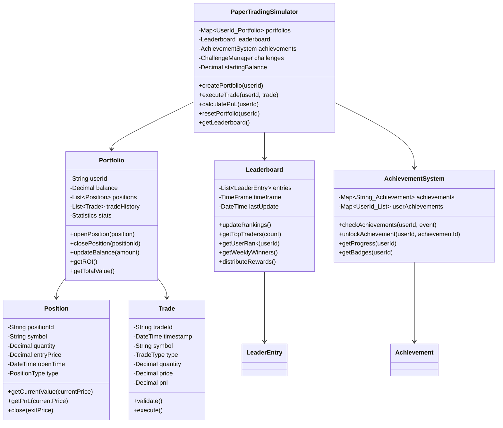
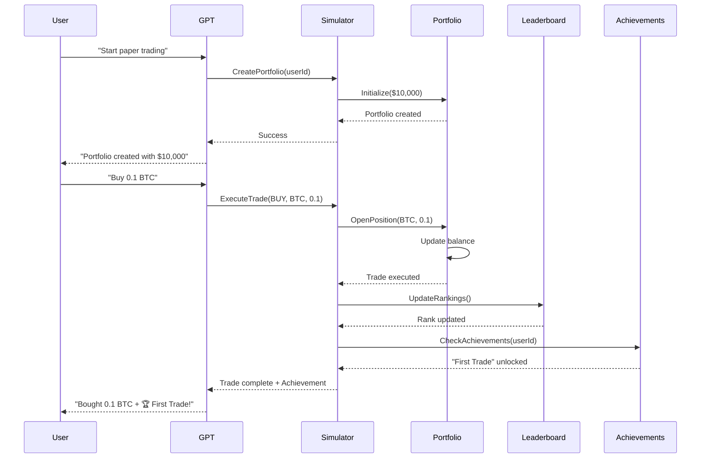
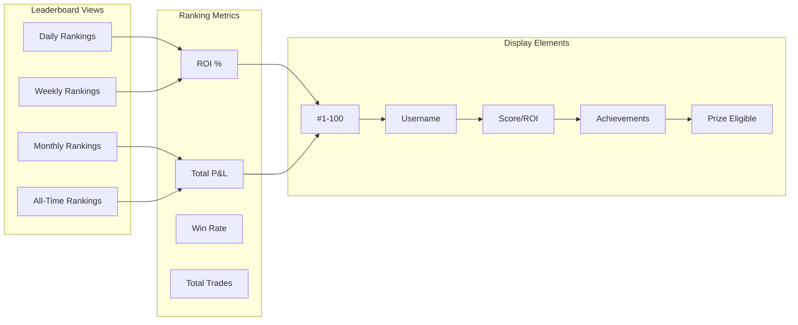
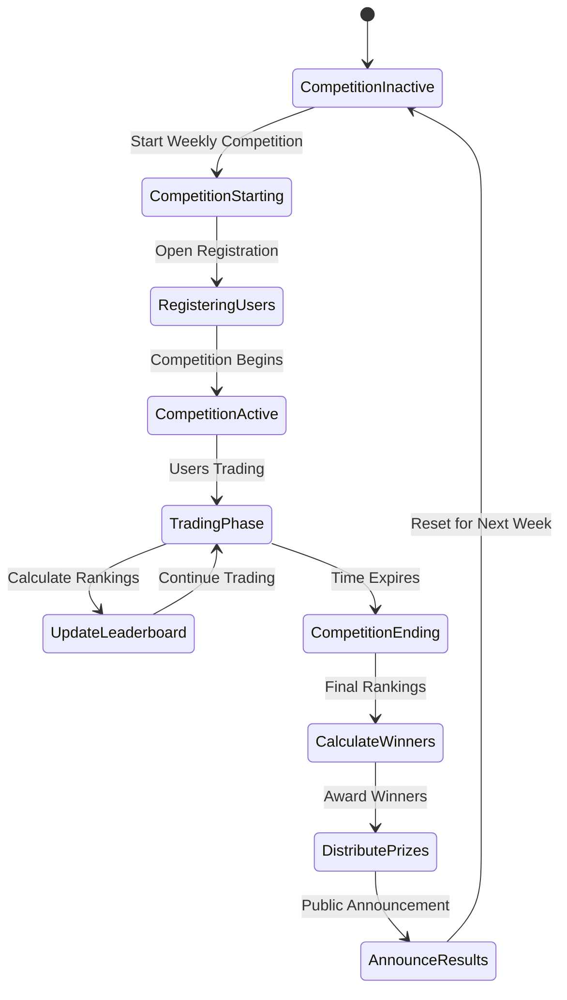

# 📊 PHASE 4: PAPER TRADING SIMULATOR - UML DIAGRAMS

## Paper Trading System Architecture

```mermaid
classDiagram
    class PaperTradingSimulator {
        -Map~UserId_Portfolio~ portfolios
        -Leaderboard leaderboard
        -AchievementSystem achievements
        -ChallengeManager challenges
        -Decimal startingBalance
        +createPortfolio(userId)
        +executeTrade(userId, trade)
        +calculatePnL(userId)
        +resetPortfolio(userId)
        +getLeaderboard()
    }

    class Portfolio {
        -String userId
        -Decimal balance
        -List~Position~ positions
        -List~Trade~ tradeHistory
        -Statistics stats
        +openPosition(position)
        +closePosition(positionId)
        +updateBalance(amount)
        +getROI()
        +getTotalValue()
    }

    class Position {
        -String positionId
        -String symbol
        -Decimal quantity
        -Decimal entryPrice
        -DateTime openTime
        -PositionType type
        +getCurrentValue(currentPrice)
        +getPnL(currentPrice)
        +close(exitPrice)
    }

    class Trade {
        -String tradeId
        -DateTime timestamp
        -String symbol
        -TradeType type
        -Decimal quantity
        -Decimal price
        -Decimal pnl
        +validate()
        +execute()
    }

    class Leaderboard {
        -List~LeaderEntry~ entries
        -TimeFrame timeframe
        -DateTime lastUpdate
        +updateRankings()
        +getTopTraders(count)
        +getUserRank(userId)
        +getWeeklyWinners()
        +distributeRewards()
    }

    class AchievementSystem {
        -Map~String_Achievement~ achievements
        -Map~UserId_List~ userAchievements
        +checkAchievements(userId, event)
        +unlockAchievement(userId, achievementId)
        +getProgress(userId)
        +getBadges(userId)
    }

    PaperTradingSimulator --> Portfolio
    PaperTradingSimulator --> Leaderboard
    PaperTradingSimulator --> AchievementSystem
    Portfolio --> Position
    Portfolio --> Trade
    Leaderboard --> LeaderEntry
    AchievementSystem --> Achievement
```

## Trading Flow Sequence

```mermaid
sequenceDiagram
    participant User
    participant GPT
    participant Simulator
    participant Portfolio
    participant Leaderboard
    participant Achievements

    User->>GPT: "Start paper trading"
    GPT->>Simulator: CreatePortfolio(userId)
    Simulator->>Portfolio: Initialize($10,000)
    Portfolio-->>Simulator: Portfolio created
    Simulator-->>GPT: Success
    GPT-->>User: "Portfolio created with $10,000"

    User->>GPT: "Buy 0.1 BTC"
    GPT->>Simulator: ExecuteTrade(BUY, BTC, 0.1)
    Simulator->>Portfolio: OpenPosition(BTC, 0.1)
    Portfolio->>Portfolio: Update balance
    Portfolio-->>Simulator: Trade executed

    Simulator->>Leaderboard: UpdateRankings()
    Leaderboard-->>Simulator: Rank updated

    Simulator->>Achievements: CheckAchievements(userId)
    Achievements-->>Simulator: "First Trade" unlocked

    Simulator-->>GPT: Trade complete + Achievement
    GPT-->>User: "Bought 0.1 BTC + 🏆 First Trade!"
```

## Achievement System

```mermaid
graph TB
    subgraph "Achievement Categories"
        Trading[Trading Achievements]
        Profit[Profit Achievements]
        Streak[Streak Achievements]
        Special[Special Achievements]
    end

    subgraph "Trading Achievements"
        FT[First Trade - 10pts]
        T10[10 Trades - 25pts]
        T100[100 Trades - 100pts]
    end

    subgraph "Profit Achievements"
        FP[First Profit - 15pts]
        P1K[+$1,000 Profit - 50pts]
        P10K[+$10,000 Profit - 200pts]
    end

    subgraph "Streak Achievements"
        W3[3 Wins Streak - 20pts]
        W10[10 Wins Streak - 75pts]
        DH[Diamond Hands - 100pts]
    end

    subgraph "Special Achievements"
        WS[Whale Spotter - 50pts]
        TTM[To The Moon - 150pts]
        BB[Big Brain - 100pts]
    end

    Trading --> FT
    Trading --> T10
    Trading --> T100

    Profit --> FP
    Profit --> P1K
    Profit --> P10K

    Streak --> W3
    Streak --> W10
    Streak --> DH

    Special --> WS
    Special --> TTM
    Special --> BB
```

## Leaderboard Display

```mermaid
graph LR
    subgraph "Leaderboard Views"
        Daily[Daily Rankings]
        Weekly[Weekly Rankings]
        Monthly[Monthly Rankings]
        AllTime[All-Time Rankings]
    end

    subgraph "Ranking Metrics"
        ROI[ROI %]
        PnL[Total P&L]
        WinRate[Win Rate]
        Trades[Total Trades]
    end

    subgraph "Display Elements"
        Rank[#1-100]
        User[Username]
        Score[Score/ROI]
        Badge[Achievements]
        Prize[Prize Eligible]
    end

    Daily --> ROI
    Weekly --> ROI
    Monthly --> PnL
    AllTime --> PnL

    ROI --> Rank
    PnL --> Rank
    Rank --> User
    User --> Score
    Score --> Badge
    Badge --> Prize
```

## Competition Management

```mermaid
stateDiagram-v2
    [*] --> CompetitionInactive

    CompetitionInactive --> CompetitionStarting: Start Weekly Competition

    CompetitionStarting --> RegisteringUsers: Open Registration
    RegisteringUsers --> CompetitionActive: Competition Begins

    CompetitionActive --> TradingPhase: Users Trading
    TradingPhase --> UpdateLeaderboard: Calculate Rankings
    UpdateLeaderboard --> TradingPhase: Continue Trading

    TradingPhase --> CompetitionEnding: Time Expires
    CompetitionEnding --> CalculateWinners: Final Rankings

    CalculateWinners --> DistributePrizes: Award Winners
    DistributePrizes --> AnnounceResults: Public Announcement

    AnnounceResults --> CompetitionInactive: Reset for Next Week
```