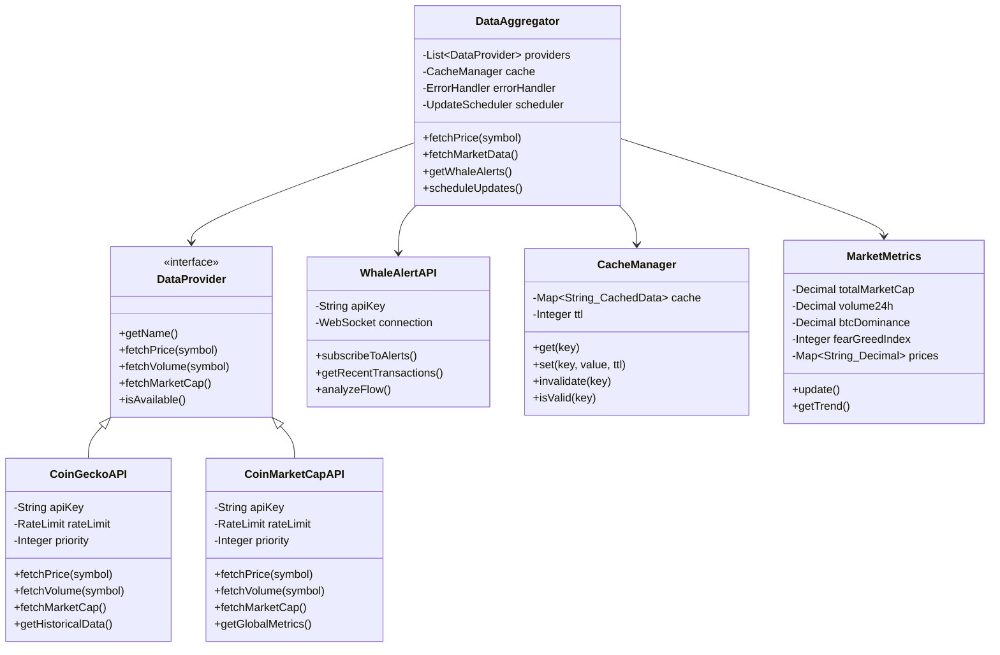
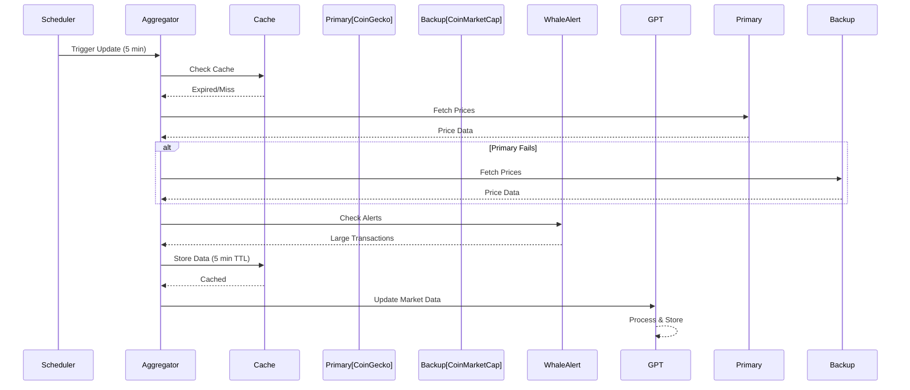
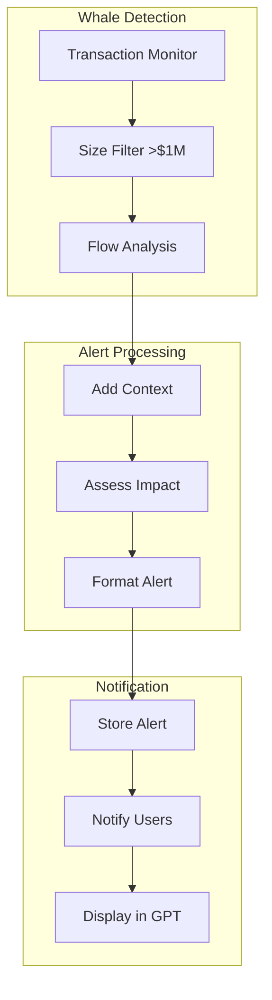
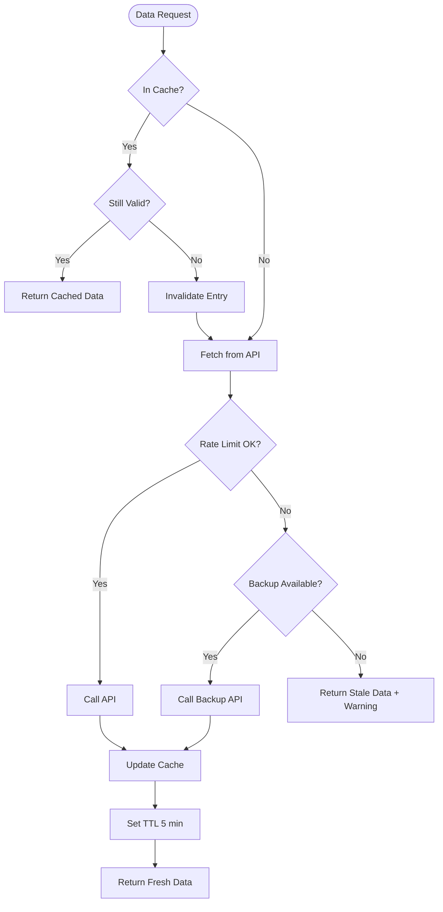
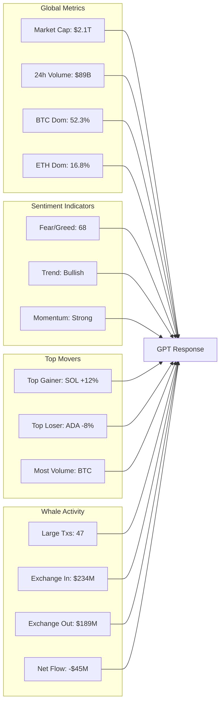
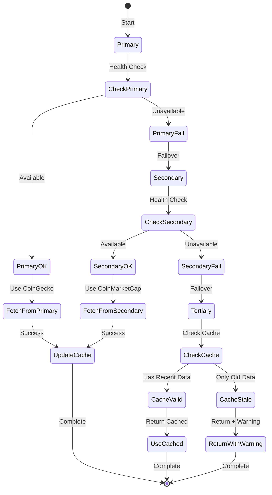

# 📊 PHASE 5: REAL-TIME DATA INTEGRATION - UML DIAGRAMS

## Data Integration Architecture

## Real-Time Update Flow

## Whale Alert System

## Cache Strategy

## Market Metrics Dashboard

## API Failover Strategy

