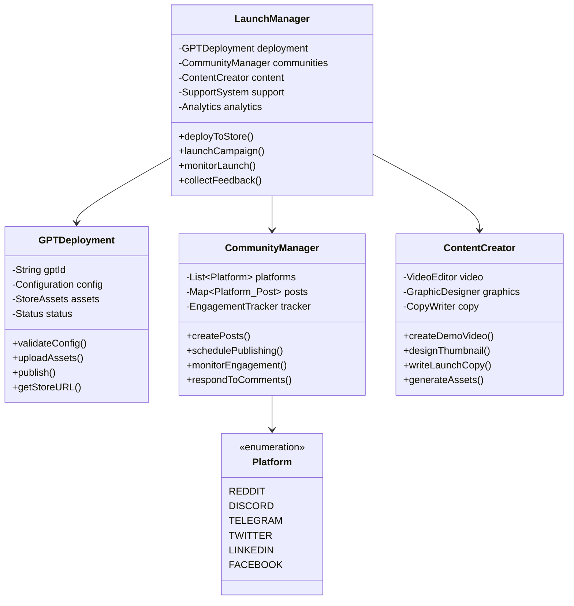
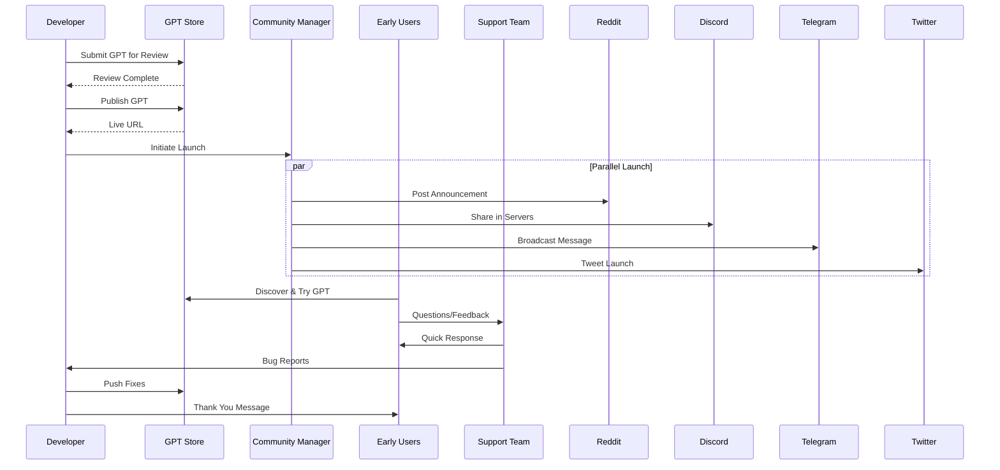
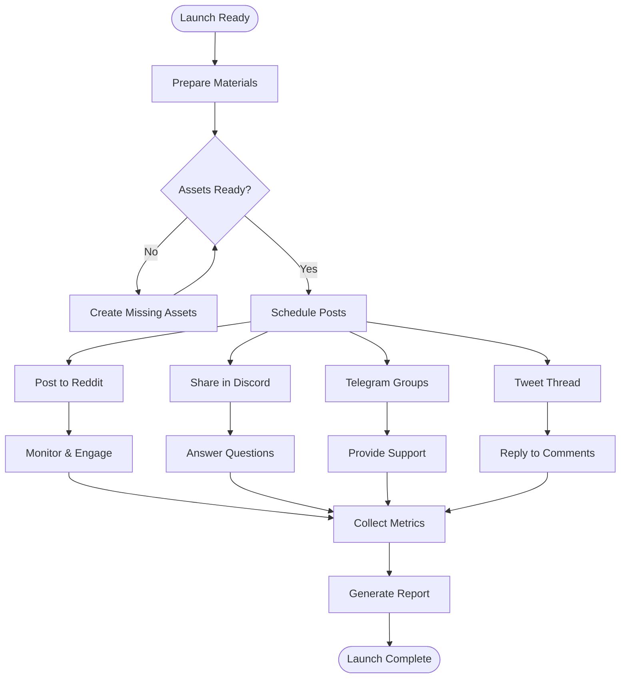
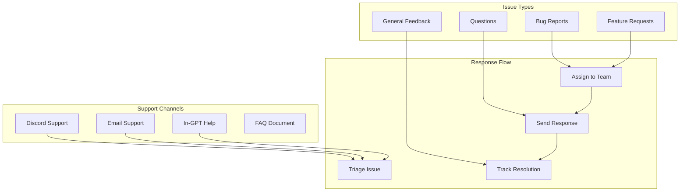
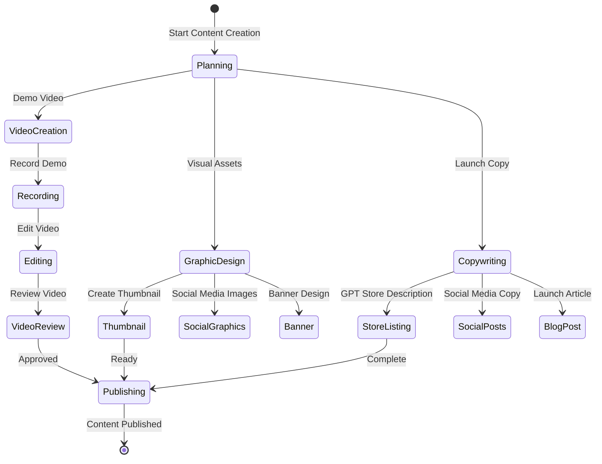
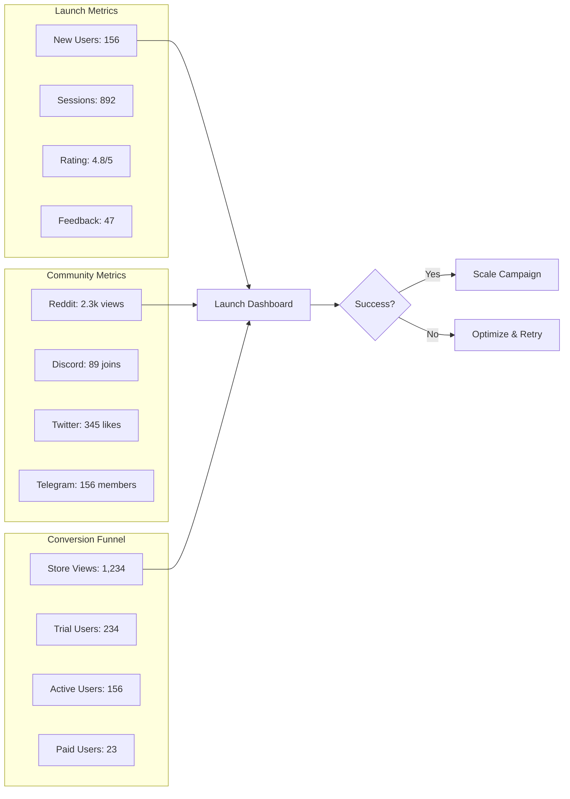

# 📊 PHASE 6: COMMUNITY LAUNCH - UML DIAGRAMS

## Launch Strategy Architecture

## Launch Sequence

## Community Posting Flow

## Support System

## Content Creation Pipeline

## Analytics Dashboard

## Launch Day Timeline

```mermaid
gantt
    title Launch Day Schedule
    dateFormat HH:mm
    axisFormat %H:%M

    section Preparation
    Final Testing           :done, 08:00, 1h
    Asset Check            :done, 09:00, 30m
    Team Briefing          :done, 09:30, 30m

    section Deployment
    GPT Store Publish      :active, 10:00, 30m
    Verify Live            :10:30, 30m

    section Community Launch
    Reddit Posts           :11:00, 30m
    Discord Announce       :11:30, 30m
    Telegram Broadcast     :12:00, 30m
    Twitter Thread         :12:30, 30m
    LinkedIn Article       :13:00, 30m

    section Support
    Monitor Feedback       :13:30, 2h
    Quick Fixes           :15:30, 1h
    Thank Early Users     :16:30, 30m

    section Review
    Metrics Review        :17:00, 30m
    Team Debrief         :17:30, 30m
    Plan Day 2           :18:00, 30m
```

