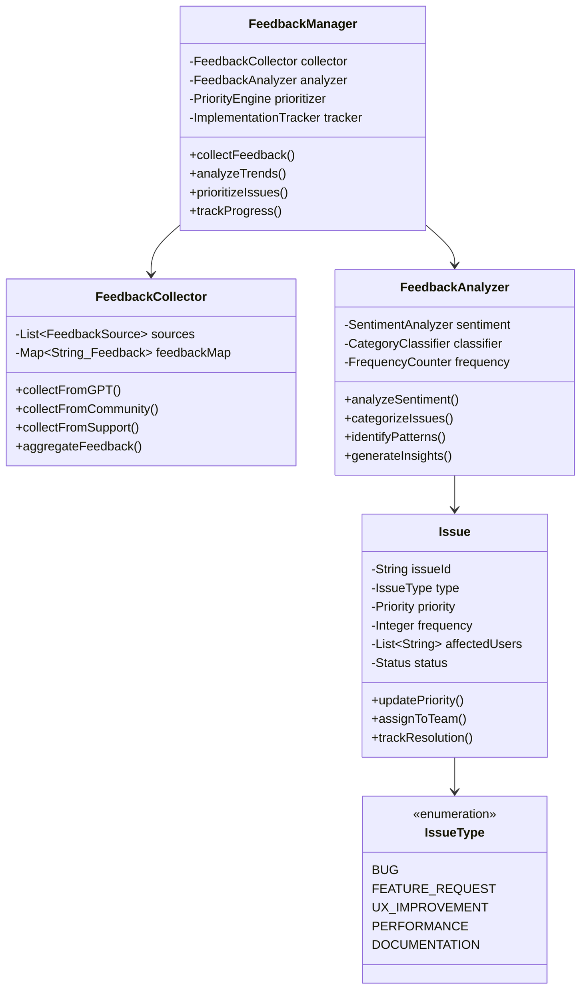
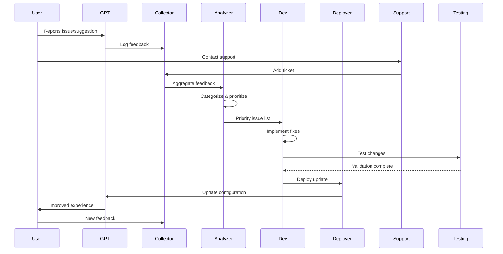
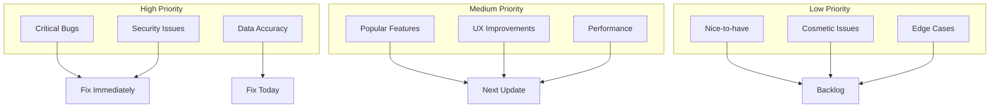
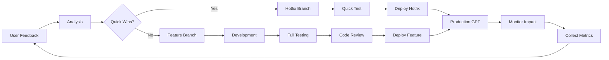
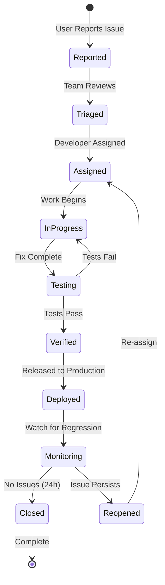
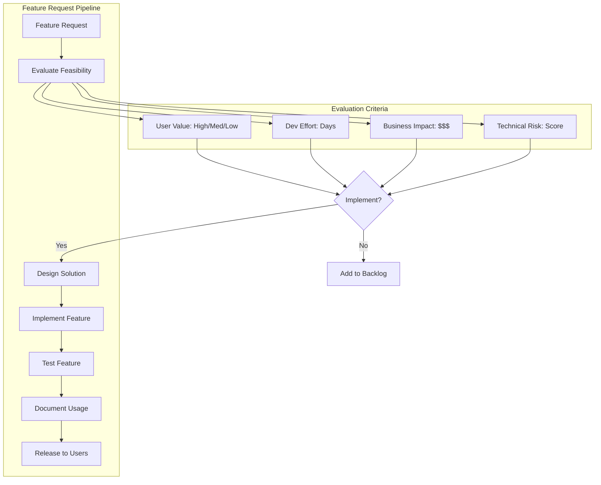
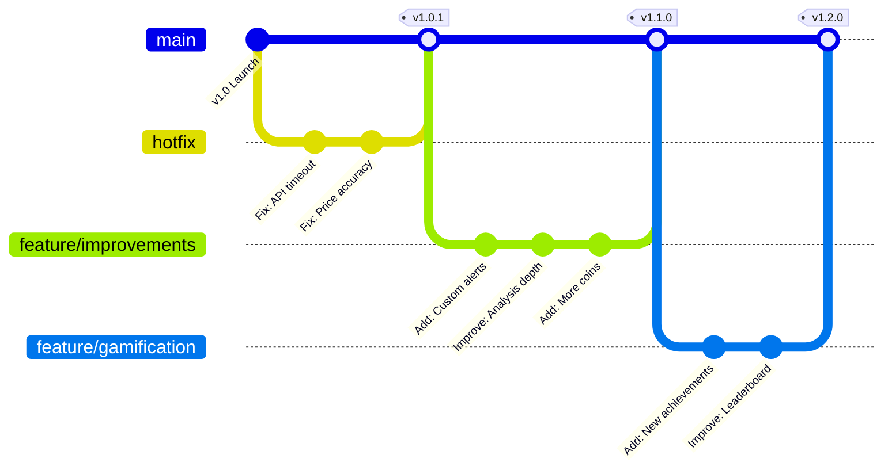

# 📊 PHASE 7: FEEDBACK ITERATION - UML DIAGRAMS

## Feedback Management System

## Feedback Processing Flow

## Priority Matrix

## Update Development Pipeline

## Issue Tracking State Machine

## Feature Implementation Flow

## Version Control Strategy

