# 📊 PHASE 8: VIRAL GROWTH CAMPAIGN - UML DIAGRAMS

## Viral Growth System Architecture


## Referral Flow Sequence

```mermaid
sequenceDiagram
    participant User as Existing User
    participant GPT as CryptoSignals AI
    participant System as Referral System
    participant Friend as New User
    participant Rewards as Reward Engine

    User->>GPT: "Get my referral link"
    GPT->>System: Generate unique code
    System-->>GPT: Referral link created
    GPT-->>User: "Share this: app.com/ref/ABC123"

    User->>Friend: Shares link
    Friend->>System: Clicks referral link
    System->>System: Track referral source

    Friend->>GPT: Signs up & tries GPT
    GPT->>System: New user registered
    System->>System: Link to referrer

    System->>Rewards: Calculate rewards
    Rewards-->>User: +1 month premium
    Rewards-->>Friend: Welcome bonus

    GPT-->>User: "🎉 Friend joined! Premium unlocked!"
    GPT-->>Friend: "Welcome! Here's your bonus"
```



## Social Proof Generation


## Influencer Outreach Pipeline


## Viral Loop Mechanism


## FOMO Creation Strategy

```mermaid
graph TB
    subgraph "Scarcity Tactics"
        Limited[Limited Spots: "Only 50 left!"]
        Timer[Countdown Timer: "Ends in 24h"]
        Exclusive[Exclusive Access: "Invite Only"]
    end

    subgraph "Social Pressure"
        Others[Others Winning: "John made $500"]
        Missing[Missing Out: "127 joined today"]
        Trending[Trending Now: "🔥 Hot"]
    end

    subgraph "Urgency Triggers"
        Price[Price Increase: "Going up tomorrow"]
        Bonus[Bonus Ending: "Last day for 2x"]
        Competition[Competition: "Leaderboard closing"]
    end

    Limited --> Action[User Takes Action]
    Timer --> Action
    Others --> Action
    Missing --> Action
    Price --> Action
    Competition --> Action

    Action --> Conversion[Converts to Paid]
    Action --> Share[Shares with Friends]
    Action --> Engage[Increases Engagement]
```

## Content Marketing Funnel


## Growth Metrics Dashboard

