# 📊 PHASE 9: PREMIUM FEATURES - UML DIAGRAMS

## Premium System Architecture

## Payment Flow Sequence

```mermaid
sequenceDiagram
    participant User
    participant GPT
    participant PaymentUI
    participant Stripe
    participant System
    participant Features

    User->>GPT: "Upgrade to Premium"
    GPT->>PaymentUI: Show pricing options

    PaymentUI->>User: Display tiers
    Note over PaymentUI: Basic $9<br/>Pro $29<br/>Enterprise $99

    User->>PaymentUI: Select Pro ($29)
    PaymentUI->>Stripe: Create checkout session

    Stripe->>User: Payment form
    User->>Stripe: Enter card details
    Stripe->>Stripe: Process payment

    Stripe->>System: Webhook: payment.success
    System->>System: Create subscription

    System->>Features: Unlock Pro features
    Features->>GPT: Features enabled

    GPT->>User: "🎉 Welcome to Pro!"
    User->>GPT: Access premium features
```

## Feature Comparison Matrix

## Subscription Lifecycle

## Premium Features Architecture

## Conversion Funnel

## Billing Management System

## Revenue Analytics Dashboard

