# 📊 CRYPTOSIGNALS AI - COMPREHENSIVE UML DOCUMENTATION
## Complete System Architecture & Design

---

## 🏗️ SYSTEM OVERVIEW

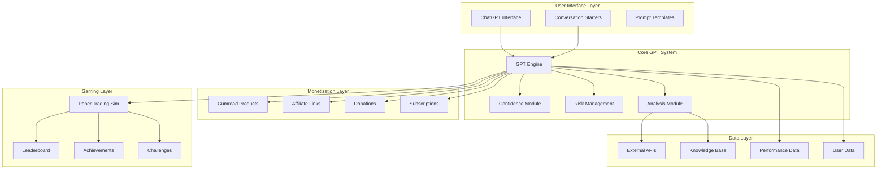

---

## 📦 CLASS DIAGRAM - CORE SYSTEM

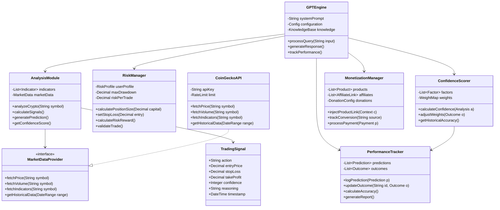

---

## 🎮 GAMIFICATION SYSTEM

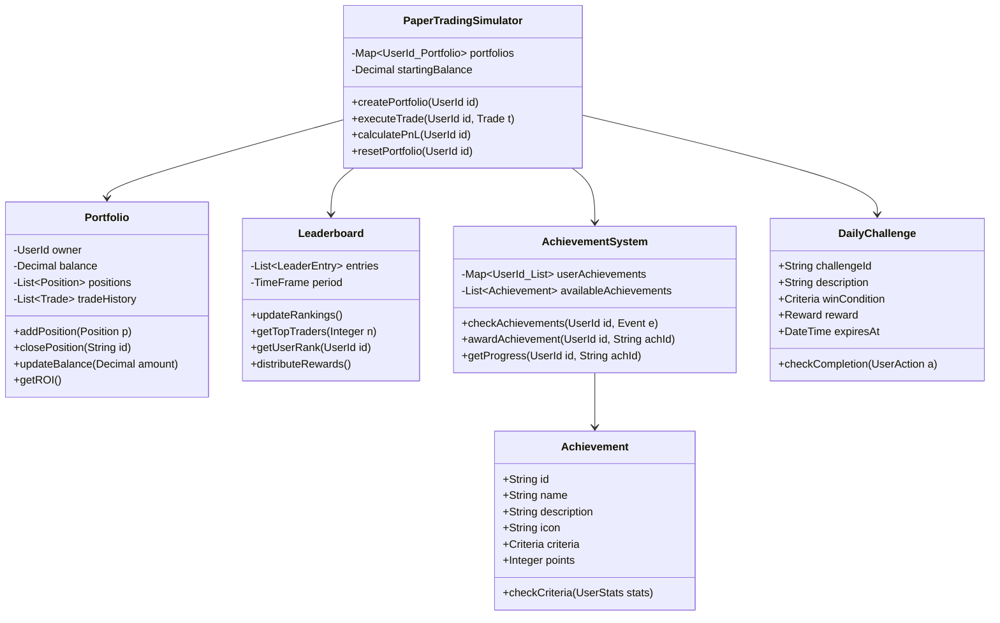

---

## 🔄 SEQUENCE DIAGRAM - TRADING ANALYSIS FLOW

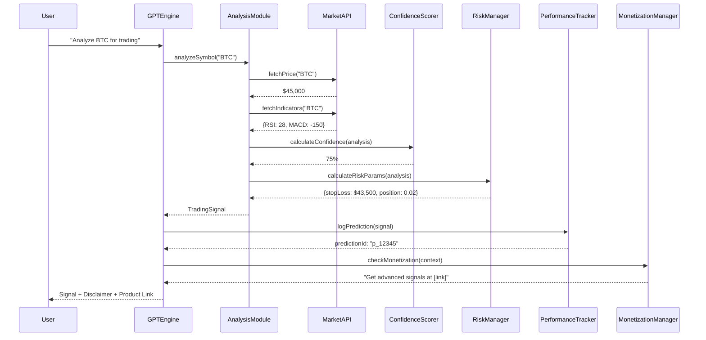

---

## 📊 STATE DIAGRAM - USER JOURNEY

```mermaid
stateDiagram-v2
    [*] --> NewUser

    NewUser --> FirstQuery: Asks question
    FirstQuery --> FreeAnalysis: Receives response
    FreeAnalysis --> Engaged: Multiple queries
    FreeAnalysis --> Churned: Leaves

    Engaged --> TrialPaperTrading: Tries simulator
    Engaged --> ProductViewer: Clicks product link
    Engaged --> Donor: Makes donation

    TrialPaperTrading --> ActiveTrader: Regular use
    ProductViewer --> Customer: Purchases
    Donor --> Supporter: Regular donations

    ActiveTrader --> PremiumUser: Subscribes
    Customer --> PremiumUser: Upgrades

    PremiumUser --> VIP: High engagement
    PremiumUser --> Retained: Active user

    Churned --> [*]
    Retained --> Advocate: Refers others
    VIP --> Advocate: Promotes
    Advocate --> [*]

    state "Monetization States" {
        Customer
        Supporter
        PremiumUser
        VIP
    }
```

---

## 💰 MONETIZATION FLOW

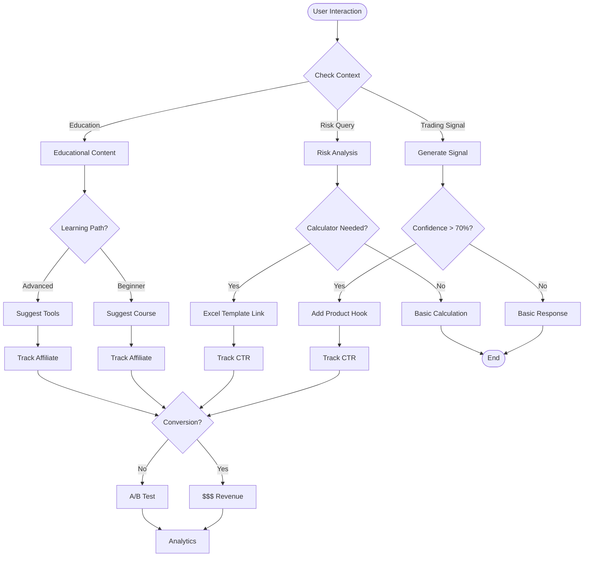

---

## 🏛️ ARCHITECTURE COMPONENTS

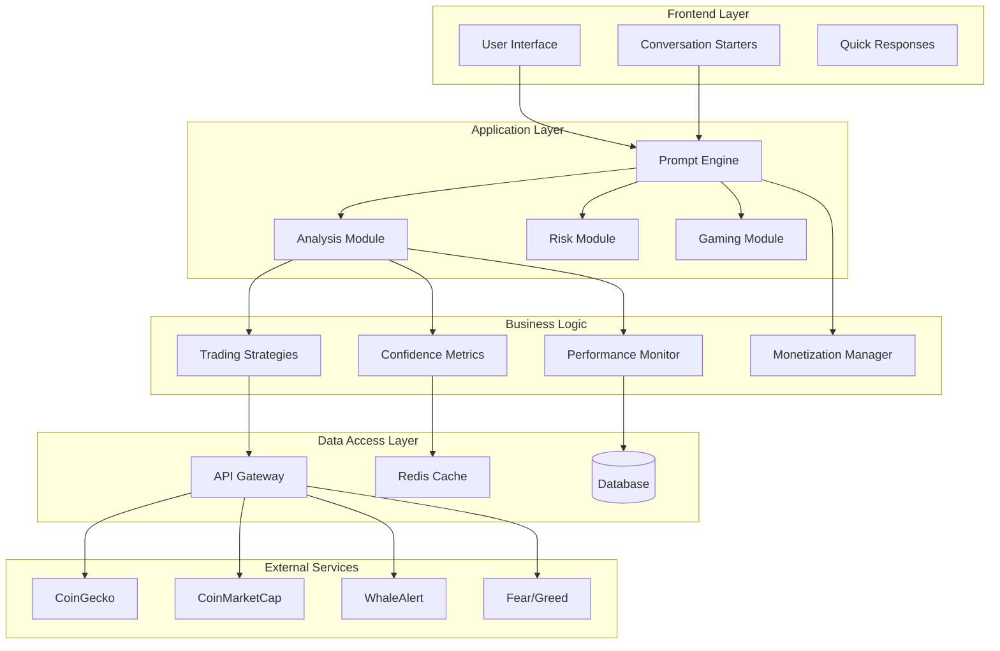

---

## 🔐 SECURITY & DATA FLOW

```mermaid
flowchart LR
    subgraph "Input Validation"
        IV[Input Validator]
        SF[Sanitization Filter]
        RL[Rate Limiter]
    end

    subgraph "Processing"
        AUTH[Authentication]
        AUTHZ[Authorization]
        PROC[Processor]
    end

    subgraph "Data Protection"
        ENC[Encryption]
        HASH[Hashing]
        MASK[Data Masking]
    end

    subgraph "Output"
        DISC[Disclaimer]
        FILT[Content Filter]
        LOG[Audit Log]
    end

    User --> IV
    IV --> SF
    SF --> RL
    RL --> AUTH
    AUTH --> AUTHZ
    AUTHZ --> PROC
    PROC --> ENC
    ENC --> HASH
    HASH --> MASK
    MASK --> DISC
    DISC --> FILT
    FILT --> LOG
    LOG --> Response
```

---

## 📈 PERFORMANCE TRACKING SYSTEM

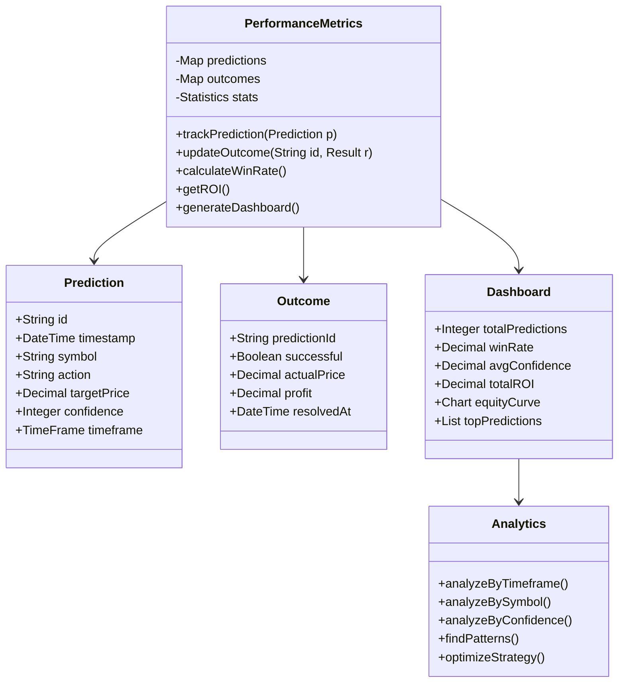

---

## 🎯 USER INTERACTION PATTERNS

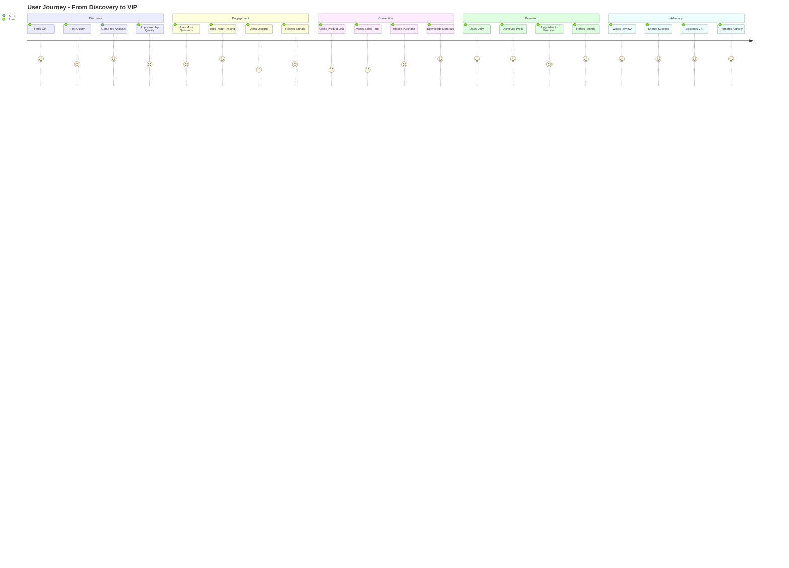

---

## 🔄 CONTINUOUS IMPROVEMENT CYCLE

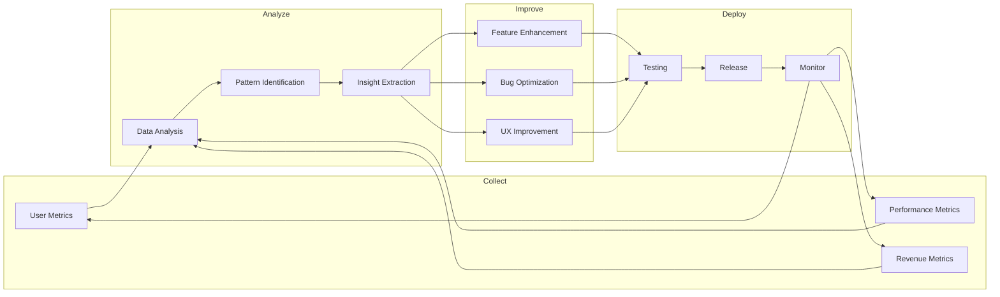

---

## 🚀 DEPLOYMENT ARCHITECTURE

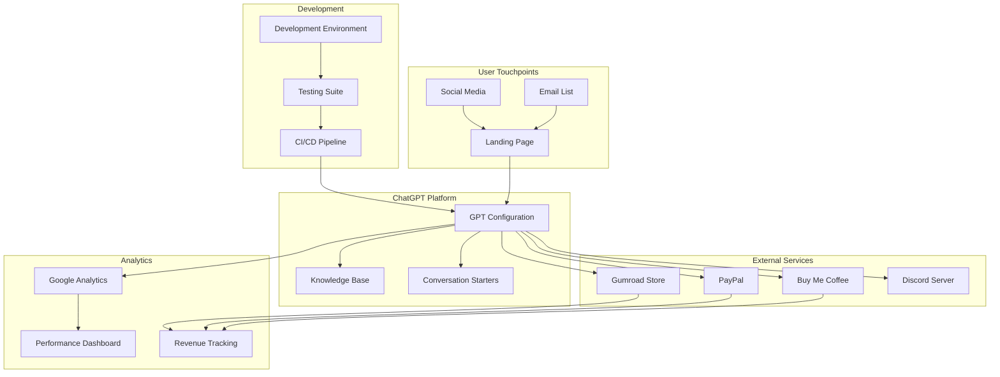

---

## 📋 ERROR HANDLING & RECOVERY

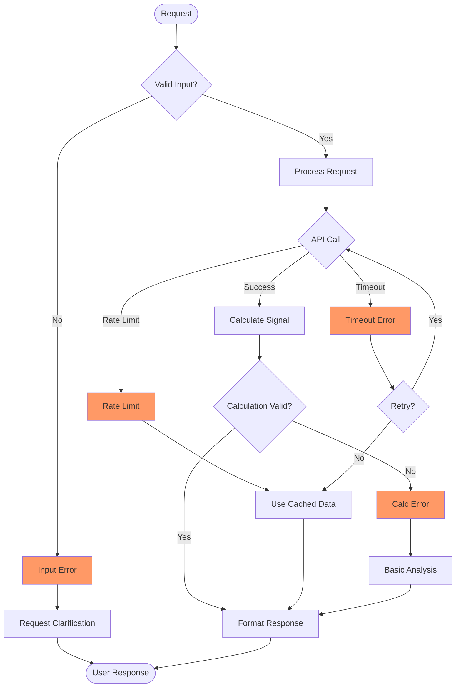

---

## 🎯 QUALITY ASSURANCE PIPELINE

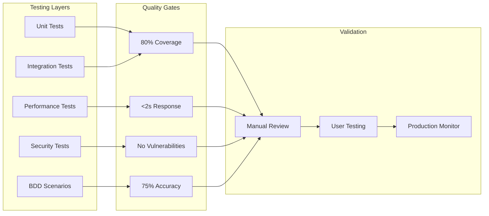

---

## 📊 METRICS & KPI TRACKING

```mermaid
graph TB
    subgraph "User Metrics"
        DAU[Daily Active Users]
        MAU[Monthly Active Users]
        RET[Retention Rate]
        CHURN[Churn Rate]
    end

    subgraph "Performance Metrics"
        ACC[Accuracy Rate]
        CONF[Avg Confidence]
        WIN[Win Rate]
        ROI[Return on Investment]
    end

    subgraph "Revenue Metrics"
        MRR[Monthly Recurring]
        LTV[Lifetime Value]
        CAC[Customer Acquisition]
        CONV[Conversion Rate]
    end

    subgraph "Engagement Metrics"
        MSG[Messages/User]
        TIME[Session Duration]
        FEAT[Feature Usage]
        REF[Referral Rate]
    end

    DAU --> Dashboard
    MAU --> Dashboard
    RET --> Dashboard
    CHURN --> Dashboard
    ACC --> Dashboard
    CONF --> Dashboard
    WIN --> Dashboard
    ROI --> Dashboard
    MRR --> Dashboard
    LTV --> Dashboard
    CAC --> Dashboard
    CONV --> Dashboard
    MSG --> Dashboard
    TIME --> Dashboard
    FEAT --> Dashboard
    REF --> Dashboard

    Dashboard[Analytics Dashboard]
```

---

## 🔗 INTEGRATION POINTS

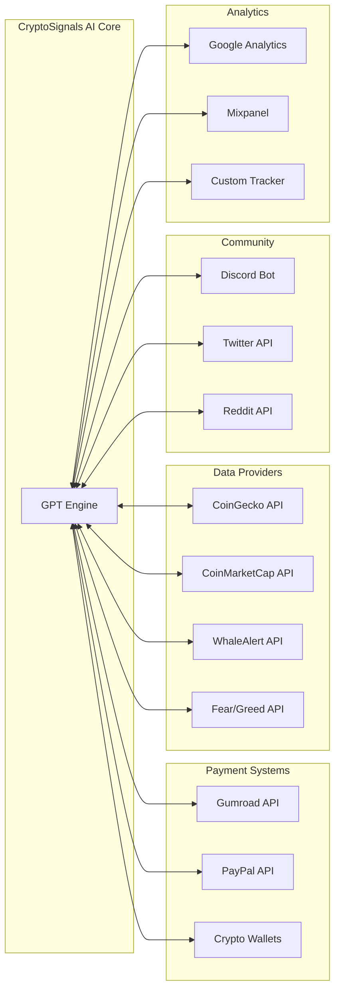

---

## 📝 SUMMARY

This comprehensive UML documentation covers:
- ✅ System Architecture Overview
- ✅ Core Class Structures
- ✅ Gamification System Design
- ✅ Sequence Flows for Key Operations
- ✅ State Diagrams for User Journey
- ✅ Monetization Flow Logic
- ✅ Security & Data Protection
- ✅ Performance Tracking Systems
- ✅ Error Handling Patterns
- ✅ Quality Assurance Pipeline
- ✅ Metrics & KPI Structure
- ✅ Integration Architecture

All diagrams follow Mermaid syntax and can be rendered in any Markdown viewer that supports Mermaid.

---

*Generated: 2024-09-24*
*Version: 1.0*
*CryptoSignals AI System Architecture*